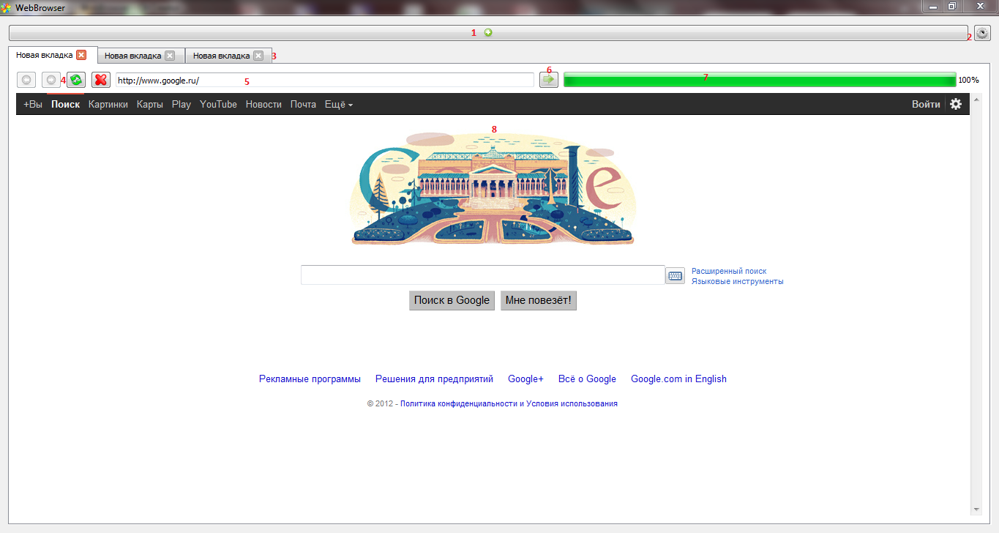
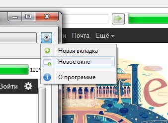

# WebBrowser - simple Internet browser

    
     
    <i>Browser window</i>
     
     
    
     
    <i>Download file</i>
     
     
    
     
    <i>Settings menu</i>

 
This is my first university course work :) 
 
Authors: Vladimir Sushkov and Pavel Lebed' 
Development tools: C++/Qt/Webkit
